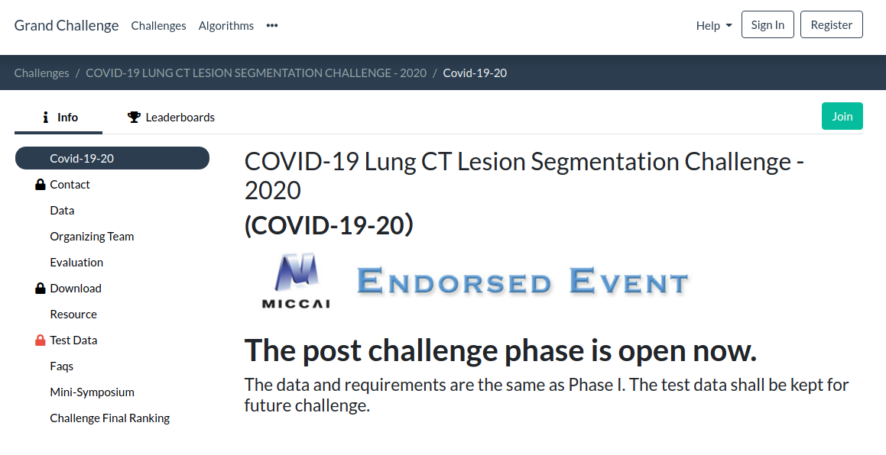
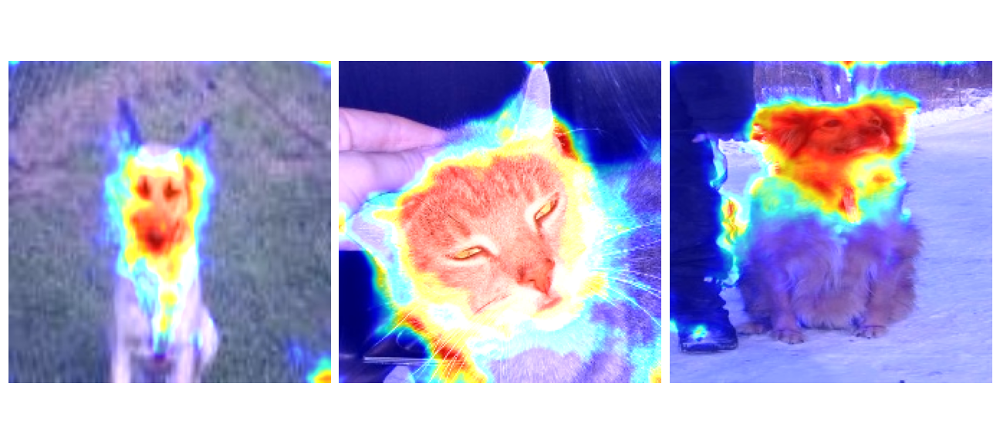

# COVID-19半监督框架使用简明文档

此文档用于说明如何使用基于[nnUNet](https://github.com/MIC-DKFZ/nnUNet)的此框架对[COVID-19 Lung CT Lesion Segmentation Challenge - 2020](https://covid-segmentation.grand-challenge.org/)的数据集进行新冠肺炎病变的分割。由于安装步骤与nnUNet原仓库一致，因此详细的安装过程及常用指令等可以参照[原nnUNet仓库](https://github.com/MIC-DKFZ/nnUNet#installation)，此处仅做简要说明。

## 数据集的获取

目前，新冠肺炎相关的开源数据集包括以下三种：

1. [Mosmed-1110](https://github.com/neuro-ml/COVID-19-Triage)。它包含 50 个带mask的 CT 和 1000 多个不带mask的 CT，因此可以用于半监督学习的研究。
2. COVID-19 Lung CT Lesion Segmentation Challenge - 2020。它包括199个多站点带mask的 CT 作为训练集，并提供了online的测试环境来对验证集~~和测试集（比赛后已关闭）~~进行验证，以保证算法多于多站点分割结果的泛化性。
3. [Medseg](http://medicalsegmentation.com/covid19/)。一个数据量小但有名的数据集，也许它可以作为few shot设置的数据集或者外部测试集进行使用。

由于COVID-19 Lung CT Lesion Segmentation Challenge - 2020数据集是目前新冠肺炎开源数据集中标注数据量最大的开源数据集，因此选择去除其一部分标注数据来实现半监督的设置。数据集的获取方法为：

1. 进入[COVID-19 Lung CT Lesion Segmentation Challenge - 2020](https://covid-segmentation.grand-challenge.org/)官方网站。
    
    
    
2. 点击右上角的Register进行账号注册并Sign in，然后点击右上角的Join按钮，申请加入该比赛。
3. 申请通过后，点击左边的Download选项卡获取下载链接进行下载。

## 框架的安装

由于本框架是基于nnUNet框架进行fork后改造的，改造本身没有对egg版本发布及打包做修改，因此框架的安装可以参照原nnUNet仓库的安装教程，只是在路径方面做一些改动：

1. （可选）使用python虚拟环境进行安装。当要进行包版本的切换时，bare环境将不能满足使用的需求，因此需要安装虚拟环境，在activate虚拟环境后进行安装：
    
    ```bash
    #拥有机器管理权限时
    #可选，没有安装时需要安装
    sudo apt install python3-venv
    python3 -m venv env_name
    #没有机器管理权限时
    pip install virtualenv
    #--python链接到真正的python bin文件
    virtualenv --python=/home/user0xx/.conda/envs/conda_env_name/bin/python3.7 new_env_name
    ```
    
2. 克隆仓库和其子仓库，同步其子仓库：
    
    ```bash
    git clone --recursive https://github.com/tea321000/paper_code
    cd paper_code
    # if you are updating an existing checkout
    git submodule sync
    git submodule update --init --recursive --jobs 0
    ```
    
3. 参照[原nnUNet仓库](https://github.com/MIC-DKFZ/nnUNet#installation)的安装教程来安装修改后的nnUNet框架。确保相关的环境变量已经设置好（也可以通过写入到.bashrc来持久化这些环境变量，否则仅在terminal的session上下文中有效）：
    
    ```bash
    # some APIs in the recently updated version of batchgenerators have changed, so it is recommended to use the old version
    pip install batchgenerators==0.21
    cd semi_supervised/nnUNet
    pip install -e .
    # you can write environment variables into .bashrc
    export nnUNet_raw_data_base="/media/fabian/nnUNet_raw"
    export nnUNet_preprocessed="/media/fabian/nnUNet_preprocessed"
    export RESULTS_FOLDER="/media/fabian/nnUNet_trained_models"
    # check if the environment variable has been set
    echo $nnUNet_raw_data_base
    echo $nnUNet_preprocessed
    echo $RESULTS_FOLDER
    ```
    

## 框架的使用

nnUNet框架使用了即插即用的设计思路，将静态的网络结构与动态的训练输入输出和超参进行分离，在训练和测试时遵循以下规则寻找网络结构和输入输出管道：

1. 于`nnunet/training/network_training/`的文件夹以及子文件夹中递归寻找与命令指定的Trainer名字相同py文件的训练器作为输出输入管道；
2. 该训练器的py文件中通过import将model对象关联至`nnunet/network_architecture/`的对应静态网络结构，完成静态网络结构与动态训练管道的绑定。

因此，框架的改造只需要在这些文件夹下新增对应的训练器以及网络结构，即可复用[原nnUNet仓库的指令](https://github.com/MIC-DKFZ/nnUNet#model-training)。接下来将简要说明如何使用此框架对COVID-19 Lung CT Lesion Segmentation Challenge - 2020数据集进行新冠肺炎病变的分割。

### 任务的建立和预处理

首先，需要将原始的数据集结构导入到nnUNet框架中。由于数据集中带的excel文件提供了不同患者CT图像对应的文件名，因此我使用了excel信息来进行转换。具体的转换脚本写法可以参照nnUNet仓库，其实主要的作用是生成数据集对应的json_dict供后面的训练和测试使用（尤其是图像的模态以及标签的不同类别分别代表什么，在此任务中只有单模态CT，标签类别0为背景，1为新冠肺炎病变前景）。json_dict的生成方法有很多，并不唯一，此处仅提供参考写法：

```bash
cd ../scripts
#修改downloaded_data_dir为数据集下载路径，Task id默认为200
vim COVID_19_20.py
#进行转换
python COVID_19_20.py
```

### 全监督基线网络的训练

全监督基线网络包括低分辨率网络和高分辨率网络的训练：

```bash
#由于后面要进行集成，因此需要加上--npz参数
nnUNet_train 3d_fullres nnUNetTrainerV2 200 4 --npz
nnUNet_train 3d_lowres nnUNetTrainerV2 200 4 --npz
#将低分辨率结果与高分辨率结果集成
nnUNet_ensemble -f lowres_predictions fullres_predictions -o ensemble_predictions
```

### 半监督网络的训练

半监督网络是基于全监督基线网络的权重进行训练的，因此需要手动将全监督基线网络的权重复制到半监督网络中。当复制好了之后，将`nnUNetTrainerV2` 替换为`nnUNetTrainerV2_moe`即可进行训练：

```bash
#由于不需要集成，因此后面可以不用加--npz参数
nnUNet_train 3d_fullres nnUNetTrainerV2_moe 200 4
```

### （可选）grad-CAM注意力机制图的生成

grad-CAM最早用于分类任务中，可以在不修改网络结构的前提下对分类的神经网络最后一层的梯度进行可视化，可以获得神经网络的注意力图，即在图像的softmax概率以外给人类理解神经网络提供了一个具有可解释性的视角。其具体推导过程可以[参考此处](https://hackmd.io/@JnG8USZ1ScOdvJ3nIzGiqQ/B1EI-DcD7?type=view)：



而对于分割任务来说，输出的结果原本就是体素级的softmax概率，输出本身就在一定程度上表征了其不同位置的注意力，因此其梯度的可视化更多是作为一个attention map起辅助作用，其意义没有分类任务中这么大。本框架的Grad CAM生成依赖[M3d-Cam](https://github.com/MECLabTUDA/M3d-Cam)进行生成：

```bash
#安装
pip install medcam
#在Trainer中加入这些行，将model重定向至梯度输出，不需要修改原来的网络结构
from medcam import medcam
#...
model = medcam.inject(model, output_dir="attention_maps", save_maps=True)
#接下来只要使用正常的nnUNet预测指令进行预测，输出的就是attention_map而非原来的新冠肺炎病变分割结果
nnUNet_predict -i INPUT_FOLDER -o OUTPUT_FOLDER -t 200 -m CONFIGURATION -f 4--save_npz
```